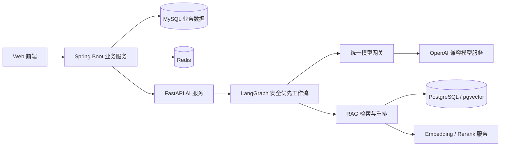
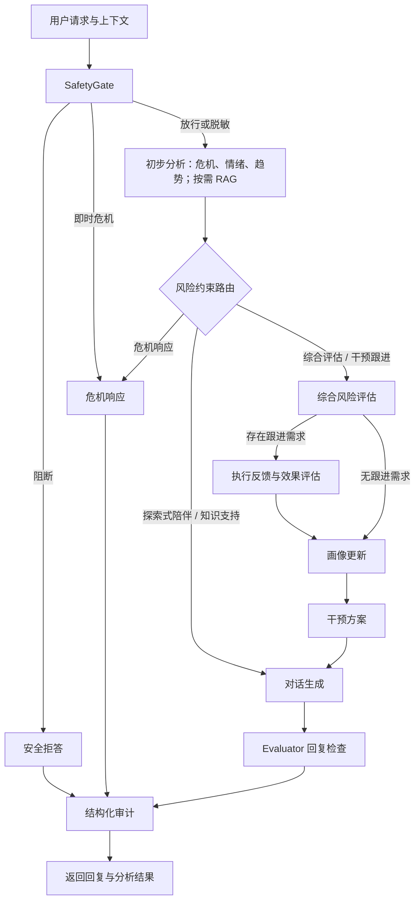
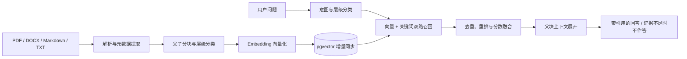

# 🌿 MoodAgent｜安全约束多智能体心理陪伴系统

> 先识别风险，再选择支持方式；让知识有来源，让决策可追溯。

MoodAgent 是面向大学生情绪支持、心理风险识别与校园求助场景的全栈原型系统。它将 Web 前端、Spring Boot 业务服务与 Python 多智能体服务连接起来，通过 **SafetyGate 前置防护、LangGraph 工作流、风险约束动态路由和分层 RAG**，在陪伴、知识支持、综合评估、干预跟进与危机响应之间选择处理路径。

**项目重点不是每轮调用所有 Agent，而是根据风险与证据，决定本轮需要哪些能力。**

> **使用边界**：本项目用于学习、研究和原型验证，不替代心理咨询、医疗诊断或紧急救援。风险标签与测评结果不是临床诊断；人工复核标记不代表已经联系到专业人员。紧急风险应联系当地急救机构或可信赖的专业人士。

[核心功能](#-核心功能) · [系统架构](#-系统架构) · [分层 RAG](#-分层-rag-与知识工程) · [评测结果](#-评测与验证) · [快速开始](#-快速开始windows) · [项目结构](#-项目结构)

## ✨ 核心功能

| 能力 | 实现与用途 |
| --- | --- |
| 💬 情绪支持与流式对话 | 结合当前表达和已有上下文生成支持性回复，提供流式编排接口 |
| 🛡️ 安全前置检查 | 识别部分 Prompt 注入、PII 和即时危机信号，执行放行、脱敏、阻断或升级 |
| 🧭 五类动态路径 | 根据危机等级、情绪负荷、趋势、知识需求和反馈信息选择处理方式 |
| 🔍 分层 RAG | 文档解析、父子分块、pgvector 向量与关键词混合召回、重排及引用溯源 |
| 📈 情绪趋势与综合评估 | 结合纵向情绪、测评和风险证据形成结构化分析，避免仅凭一轮表达下结论 |
| 🧩 画像与干预跟进 | 生成画像更新建议和可执行方案，根据执行反馈评估效果并调整计划 |
| 🧾 评估与审计 | 检查回复安全、引用和风险一致性，记录节点耗时、路径理由与版本信息 |
| 🧪 离线评测 | 提供合成红队、RAG 专项、路由对照、故障注入与性能测试入口 |

### 页面入口与演示流程

前端采用 HTML、CSS 和 JavaScript，包含以下功能入口：

| 页面 | 展示内容 |
| --- | --- |
| [对话工作台](frontend/app.html) | 对话与多智能体支持流程 |
| [情绪分析](frontend/emotion-analysis.html) / [风险识别](frontend/risk-recognition.html) | 情绪及风险分析结果 |
| [心理测评](frontend/assessment.html) / [用户画像](frontend/profile.html) | 测评信息与画像 |
| [干预跟进](frontend/intervention.html) | 干预方案与执行反馈 |
| [RAG 知识库](frontend/rag-knowledge.html) | 知识库状态与检索管理 |
| [评测中心](frontend/evaluation.html) / [审计日志](frontend/audit-log.html) | 测试结果与执行记录 |
| [服务状态](frontend/service-status.html) | 服务运行信息 |

建议演示顺序：**登录 → 情绪对话 → 知识问答与引用 → 测评 / 趋势 → 干预反馈 → 审计与评测**。以上链接指向仓库源码；交互体验需按下文启动服务。危机场景验证请使用合成测试样本，不收集真实危机文本作为演示素材。

## 🏗️ 系统架构



- **Java 业务层**：承接鉴权、业务接口与数据持久化，协调前端和 Python 服务。
- **Python AI 层**：负责 Agent 编排、模型调用、知识检索、安全检查与离线评测。
- **数据分工**：MySQL 保存业务数据；PostgreSQL 保存 RAG 切片、向量和元数据；Redis 由 Java 业务服务集成。
- **状态边界**：LangGraph 保存本次请求的短生命周期状态，历史上下文由请求传入；当前主编排器未接入持久化 Checkpointer，不应理解为跨重启的图执行恢复。

主编排实现见 [orchestrator.py](moodappPython/app/agents/orchestrator.py)。

### 安全优先执行链



图中“初步分析 + 路由”是概念拆分：路由决策在初步分析节点内产生，并通过条件边选择后续节点。

### Agent 与模块职责

| Agent / 模块 | 主要职责 |
| --- | --- |
| SafetyGate | 对输入进行 PII 检测与脱敏、注入检测、即时风险升级 |
| CrisisAgent | 结合规则、模型与上下文分析危机信号，提供安全等级和处理动作 |
| EmotionAgent | 提取情绪标签、强度及相关证据 |
| TrendAgent | 分析纵向情绪变化与干预前后趋势 |
| RAGAgent | 检索可信知识、组织引用；证据不足时返回不作答或降级信息 |
| RiskConstrainedRouter | 通过安全硬约束、可审计分值与阈值选择路径 |
| RiskAgent | 汇总风险因素，输出可解释的结构化风险结果 |
| ProfileAgent | 生成带来源与置信信息的画像更新建议 |
| InterventionAgent | 根据风险、画像和支持需求生成干预动作 |
| FollowUpAgent | 分析执行情况、效果反馈与方案调整需求 |
| ChatAgent | 在安全约束及已有分析基础上生成回复 |
| EvaluatorAgent | 检查安全、引用完整性和风险一致性，进行确定性修正 |
| AuditAgent | 汇总执行轨迹、决策链和版本快照 |

此外，[AssessmentReportAgent](moodappPython/app/agents/assessment_report_agent.py) 通过独立接口生成测评报告。Agent 注册信息见 [registry.py](moodappPython/app/agents/registry.py)；规则模块与模型 Agent 并不等同于同等数量的 LLM 调用。

## 🧭 风险约束动态路由

路由器是**确定性的安全优先评分策略**，不是让 LLM 自由决定所有执行路径。

| 路径 | 标识 | 典型触发依据 |
| --- | --- | --- |
| 探索式陪伴 | `exploratory_support` | 证据尚不充分，优先倾听和澄清 |
| 知识支持 | `knowledge_support` | 明确询问应对方法、知识或求助资源 |
| 综合评估 | `structured_assessment` | 中风险安全信号，或足够的测评与趋势证据 |
| 干预跟进 | `follow_up_support` | 已有方案及本轮执行效果反馈 |
| 危机响应 | `crisis_response` | 命中安全升级或高危硬约束 |

决策结果包含 `route`、`route_scores`、`reasons`、`evidence_sufficient`、`hard_constraint_triggered` 和 `policy_version`，便于复盘为什么进入某条路径。

**设计边界**：高危信号优先于普通路径评分；仅有“存在历史记录”不应自动触发完整评估。实现见 [risk_constrained_router.py](moodappPython/app/agents/risk_constrained_router.py)。

## 🔍 分层 RAG 与知识工程

### 1. 从原始资料到可检索知识



- **父子分块**：以较小子块参与检索，命中后关联父块补充上下文。
- **层级过滤**：先在相关子类中检索，证据不足时扩大到父类或全库；保留回退信息。
- **增量同步**：通过文档及内容哈希识别变化，保存来源、标题路径、片段位置和知识版本。
- **双路召回**：向量相似度负责语义匹配；关键词检索通过 PostgreSQL `ILIKE` 与词项覆盖评分补充召回。当前不是 BM25。
- **融合重排**：重排成功时，最终分数为 `0.35 × vector_score + 0.20 × keyword_score + 0.45 × rerank_score`；重排失败有混合检索降级路径。当前不是 RRF。
- **引用约束**：返回文档、切片与来源信息；低相关或缺乏证据时不把检索结果包装为确定结论。

主要实现：[解析](moodappPython/app/rag/document_parser.py) · [分块](moodappPython/app/rag/chunker.py) · [存储](moodappPython/app/rag/vector_store.py) · [召回](moodappPython/app/rag/retriever.py) · [重排](moodappPython/app/rag/reranker.py)。

### 2. 知识库到底存在哪里？

**原始资料与检索索引不是一回事：**

- [`moodappPython/knowledge/`](moodappPython/knowledge/) 保存入库来源文件。
- 检索使用 **PostgreSQL + pgvector**，默认表名为 `public.rag_chunks`；库名、账号、主机由 `POSTGRES_*` 配置指定。
- `rag_chunks` 保存正文、向量及元数据，`rag_index_metadata` 保存索引信息。
- 可通过前端知识库页面、`GET /v1/rag/status`，或数据库客户端查看；不是仅依靠本地 JSON 文件完成向量检索。

在自己配置的 PostgreSQL 数据库中可执行以下只读查询：

```sql
SELECT category, COUNT(*) AS chunk_count
FROM public.rag_chunks
GROUP BY category
ORDER BY category;
```

若修改过 `PGVECTOR_SCHEMA` 或 `PGVECTOR_TABLE`，请替换对应表名。切片总数随资料和分块配置变化，以实际入库报告为准。

## 🛡️ 安全、稳定性与可追溯性

| 机制 | 作用与边界 |
| --- | --- |
| 前置安全门控 | 在常规生成之前执行检查，支持脱敏、阻断与危机升级；规则覆盖并非完备 |
| 最高风险覆盖 | 避免普通回复或模型判断降低已经命中的危机等级 |
| 结构化校验 | 通过 Pydantic 约束输出；非法 JSON、超时和模型故障进入相应异常处理 |
| 连接复用与独立超时 | 复用模型、Embedding 和 Rerank 的 HTTP 连接，并按链路限制等待时间 |
| 重试、熔断与缓存 | 模型网关提供重试和熔断；RAG 使用有容量与 TTL 限制的进程内缓存 |
| 回复评估与审计 | 保留安全判断、检索依据、路由结果及节点状态，支持问题追踪 |
| 人工关注标记 | 标记需要复核的情况；不等同于已完成专业人员接管 |

Python AI 接口应仅在可信网络内使用；默认启动绑定 `127.0.0.1`。不要直接把模型调用和评测接口暴露到公网，公开部署前需补充网关鉴权、访问控制和隐私审查。

## 🧪 评测与验证

下面引用的是**仓库中保存的历史报告**，不是每次提交自动更新的实时成绩，也不代表临床有效性或真实用户效果。不同评测集的分母、覆盖范围和版本不同，不能混为同一组结果。

| 验证项目 | 时间与范围 | 报告结果 | 证据 |
| --- | --- | --- | --- |
| 完整红队 / 质量评测 | 2026-08-20，192 条本地合成案例 | 171/192 通过（89.06%）；危机召回率 98.15%；高危漏检率 0%；JSON 合法率 99.48%；P95 约 9.10 秒 | [完整报告](moodappPython/reports/evaluation/redteam_report.md) |
| RAG 专项 | 2026-08-15，60 条合成案例 | 56/60 通过；文档 Recall@5 92%；MRR@5 0.84；引用精确率 100% | [RAG 报告](moodappPython/reports/evaluation/rag_retest_after_routing_20260815.md) |
| 路由对照 | 2026-08-17，15 条合成路径固定集 | 新路由 15/15，旧规则 13/15，提升 13.33 个百分点 | [实验设计与限制](moodappPython/reports/evaluation/router_ablation_20260817_validated/FORMAL_ROUTER_COMPARISON.md) |
| Python 回归快照 | 2026-08-15 | 当次顶层测试 70/70 通过；不代表当前测试总数 | [历史测试报告](moodappPython/reports/evaluation/python_test_current_20260815.md) |

### 已知不足

- **2026-08-20 完整红队发布门禁未通过**：人工审核一致率为 89.29%，危机安全断言通过率为 98.15%，未达到报告中的对应门禁要求；仍有 21 条失败案例。
- 同轮情绪分类一致性为 65%，回答依据充分度为 74.29%，仍需改进。引用精确率高不等于答案充分或整体正确。
- 路由专项只有 15 条开发期合成案例；新旧端到端多轮配对对照受模型额度影响尚不完整，不能据此声称统计显著优势。
- 不应把合成集上的“高危漏检率 0%”解读为真实场景零漏检。

### 运行测试

从仓库根目录执行 Python 测试：

```powershell
Push-Location moodappPython
.\.venv\Scripts\python.exe -m unittest discover -s tests -v
Pop-Location
```

前端冒烟与浏览器测试：

```powershell
Push-Location frontend
npm ci
npm run test:smoke
npx playwright install chromium
npm run test:browser
Pop-Location
```

浏览器测试的服务地址与启动前提见 [Playwright 配置](frontend/playwright.config.mjs)。

离线红队与性能测试（在 `moodappPython/` 内运行，需要有效的模型及 RAG 配置，可能产生 API 费用）：

```powershell
# 默认生成带时间戳的新报告，不覆盖历史正式报告
.\.venv\Scripts\python.exe scripts/run_redteam.py --max-cases 5

# 完整测试；不指定 --max-cases 即运行当前案例集
.\.venv\Scripts\python.exe scripts/run_redteam.py

# 路由消融仅用于离线实验，不应用于线上安全链路
.\.venv\Scripts\python.exe scripts/run_redteam.py --category route_selection --disable risk_router

.\.venv\Scripts\python.exe scripts/run_performance.py --requests 20 --concurrency 2 --output reports/evaluation/performance-local.json
```

## 🛠️ 技术栈

| 层级 | 技术 |
| --- | --- |
| 前端 | HTML / CSS / JavaScript |
| 业务后端 | Java 21、Spring Boot 3.1.5、MyBatis-Plus、Maven |
| AI 服务 | Python、FastAPI、Uvicorn、Pydantic |
| 多智能体编排 | LangGraph，注册机制、条件路由与结构化轨迹 |
| 模型访问 | httpx、OpenAI 兼容接口；默认对话模型配置为 Qwen |
| RAG | pypdf、python-docx、Embedding 网关、pgvector、Rerank 网关 |
| 模型配置 | Embedding 模型需显式指定；历史入库报告使用 BGE-M3，默认 Rerank 为 `BAAI/bge-reranker-v2-m3` |
| 数据服务 | MySQL、PostgreSQL + pgvector、Redis |
| 测试 | Python unittest、Node.js Test Runner、Playwright、离线红队与消融脚本 |

模型名称只是配置值，实际可用模型及兼容接口由接入的服务商决定；本仓库不包含模型权重。

## 🚀 快速开始（Windows）

### 1. 环境准备

准备 Python 3.11+（建议）、JDK 21、Maven；前端测试还需要支持 `node --test` 的 Node.js 与 npm。完整功能依赖 MySQL、PostgreSQL（已安装 pgvector 扩展）和 Redis。

> **首次部署注意**：仓库目前提供 [MySQL 增量迁移](moodapp/demo/database/migration/)，没有完整的基础建库脚本。需先准备与实体对应的基础表，再审查并应用增量迁移；仅创建空数据库不足以运行全部业务功能。PostgreSQL 目标数据库也需预先创建，入库程序会尝试创建扩展、表与索引，账号应具有相应权限。

安装依赖和构建业务服务，以下命令从仓库根目录执行：

```powershell
python -m venv moodappPython\.venv
.\moodappPython\.venv\Scripts\python.exe -m pip install -r moodappPython\requirements.txt

Push-Location moodapp\demo
mvn package -DskipTests
Pop-Location
```

### 2. 配置环境

复制根目录模板，已有 `.env` 时保留并补充配置，不要覆盖现有密钥：

```powershell
if (-not (Test-Path .env)) {
    Copy-Item ENVIRONMENT.example .env
}
```

[ENVIRONMENT.example](ENVIRONMENT.example) 只包含部分变量，完整部署还需要按 [Python 配置](moodappPython/app/config.py) 和 [Java 配置](moodapp/demo/src/main/resources/application.yml) 补齐：

| 配置组 | 必要 / 常用变量 |
| --- | --- |
| 对话模型 | `MODEL_API_BASE_URL`、`MODEL_API_KEY`、`MODEL_NAME` |
| Embedding | `EMBEDDING_API_BASE_URL`、`EMBEDDING_API_KEY`、`EMBEDDING_MODEL` |
| Rerank | `RERANK_API_BASE_URL`、`RERANK_API_KEY`、`RERANK_MODEL` |
| PostgreSQL | `POSTGRES_HOST`、`POSTGRES_PORT`、`POSTGRES_DB`、`POSTGRES_USER`、`POSTGRES_PASSWORD` |
| 向量表 | `PGVECTOR_SCHEMA=public`、`PGVECTOR_TABLE=rag_chunks` |
| Java / MySQL | `DB_URL`（JDBC URL）、`DB_USERNAME`、`DB_PASSWORD` |
| Java 安全与模型 | `JWT_SECRET`、`QWEN_API_KEY` |
| Redis | `REDIS_HOST`、`REDIS_PORT`、`REDIS_DATABASE` |
| 跨服务调用 | `MOODAPP_AGENT_BASE_URL=http://127.0.0.1:8081` |

**配置加载位置不同**：一键启动脚本读取根目录 `.env` 并注入进程环境；单独运行 Python、入库或评测脚本时，Python 默认读取 `moodappPython/.env`。请把所需 Python 配置放入该文件，或在当前终端设置同名环境变量。单独启动 Java 时需按其配置文件准备进程环境或服务目录中的 `.env`。

所有 `.env` 均应保留在本地，不提交真实密钥、数据库密码或用户数据。

### 3. 初始化 RAG 知识库

确保 PostgreSQL、Embedding 配置已就绪，再从仓库根目录运行：

```powershell
Push-Location moodappPython
.\.venv\Scripts\python.exe -m scripts.ingest_knowledge --source knowledge --report reports/knowledge-ingestion-local.json
Pop-Location
```

默认进行增量同步。只有明确需要按当前资料快照清理旧切片时，才使用 `--rebuild`：它会删除数据库中不在本次快照里的切片。更换 Embedding 模型或维度前，应先备份并检查索引兼容性。

### 4. 启动与停止

**当前脚本路径固定为 `D:\moodA`**。若克隆到其他目录，先调整 [start-all.ps1](start-all.ps1) 中的 `$Root` 和 [stop-all.ps1](stop-all.ps1) 中的 `$Runtime`，再运行：

```powershell
Set-ExecutionPolicy -Scope Process Bypass
.\start-all.ps1
```

| 服务 | 本地访问地址 |
| --- | --- |
| Web 前端 | http://127.0.0.1:5500/index.html |
| Java 健康检查 | http://127.0.0.1:8080/actuator/health |
| Python 健康检查 | http://127.0.0.1:8081/health |
| Python API 文档 | http://127.0.0.1:8081/docs |

停止服务：

```powershell
.\stop-all.ps1
```

日志和 PID 保存在 `.runtime/`。停止脚本会终止记录的服务进程，并按 5500、8080、8081 端口兜底停止监听进程；请勿与其他程序共用这些端口。脚本不会停止 MySQL、PostgreSQL 或 Redis。

更多本地操作见 [RUN.md](RUN.md)。完整启动成功还取决于数据库表结构、账号权限、模型额度和网络连通性。

## 📡 Python 服务接口

以下是 AI 服务的主要接口，不是前端直接访问的全部业务 API。请求和响应字段以运行后的 `/docs` 及 [schemas.py](moodappPython/app/schemas.py) 为准。

| 方法 | 路径 | 用途 |
| --- | --- | --- |
| GET | `/health`、`/health/live`、`/health/ready` | 健康、存活与就绪检查 |
| POST | `/v1/agents/orchestrate` | 完整多智能体编排 |
| POST | `/v1/agents/orchestrate/stream` | 流式编排响应 |
| POST | `/v1/agents/assessment-report` | 测评报告 |
| POST | `/v1/rag/search` | 知识检索 |
| GET | `/v1/rag/status` | 知识库状态 |
| GET | `/v1/agents/registry` | Agent 注册信息 |
| GET | `/v1/metrics/model` | 模型调用指标 |
| GET | `/v1/evaluation/redteam/latest-summary` | 最近一次保存的红队摘要 |
| POST | `/v1/evaluation/redteam/run` | 运行评测，可能产生模型调用费用 |

## 📂 项目结构

```text
moodAgent/
├── frontend/                    # 页面、交互脚本与前端测试
│   ├── app.html                 # 对话工作台
│   ├── rag-knowledge.html       # 知识库页面
│   ├── evaluation.html          # 评测中心
│   └── tests/                   # 冒烟与浏览器交互测试
├── moodapp/demo/                # Java 业务服务
│   ├── src/main/java/           # 业务接口、服务与实体
│   ├── src/main/resources/      # Spring Boot 配置
│   └── database/migration/      # 增量迁移，不含完整基础库
├── moodappPython/               # Python AI 服务
│   ├── app/
│   │   ├── main.py             # FastAPI 接口入口
│   │   ├── agents/             # Agent、注册器与主 LangGraph 编排器
│   │   ├── rag/                # 解析、分块、向量化、存储与检索
│   │   ├── evaluation/         # 案例、指标、故障注入和报告生成
│   │   ├── core/               # 公共契约、轨迹与错误模型
│   │   ├── model_gateway.py    # 模型调用、连接复用、重试与熔断
│   │   └── config.py           # 配置读取
│   ├── knowledge/              # 知识库来源文档
│   ├── scripts/                # 入库、红队与性能测试脚本
│   ├── tests/                  # Python 单元与回归测试
│   ├── reports/                # 历史入库与评测证据
│   └── docs/competition/       # 方案图与项目说明
├── ENVIRONMENT.example         # 基础环境变量示例
├── start-all.ps1                # Windows 启动脚本
├── stop-all.ps1                 # Windows 停止脚本
└── RUN.md                      # 本地运行补充说明
```

## 🔮 后续计划

以下为待完善方向，不代表已经实现：

- [ ] 补齐基础数据库初始化与可移植部署流程。
- [ ] 提供脱敏界面截图和完整演示视频。
- [ ] 改进情绪一致性、校园资源召回和回答依据充分度。
- [ ] 在独立留出集上复测，并完成模型条件一致的新旧路由多轮对照。
- [ ] 完善真实部署前的访问控制、数据保留策略与人工复核流程。

## 🔐 安全与隐私

- 不在 Issue、提交记录或公开日志中粘贴 API 密钥、数据库密码及可识别个人信息。
- 合成评测报告的隐私策略不代表业务数据库不保存聊天内容；真实部署前需审查完整数据流。
- 知识库资料需核对来源、授权和更新时间；校园联系方式等易变信息应由人工维护。
- 诊断、危机识别与干预建议均有能力边界，不能以原型测试替代专业验证。

## 📄 许可证

当前仓库未提供开源许可证。如需使用、修改或分发代码及资料，请先与作者确认授权范围；知识库资料还需遵守各自来源的授权条件。
